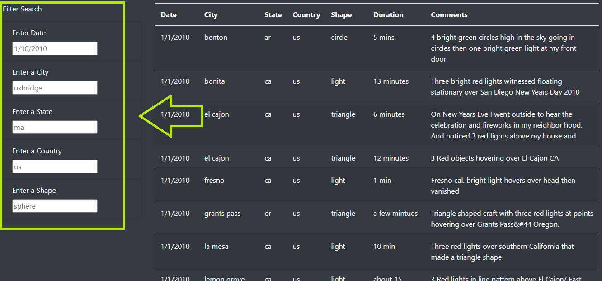
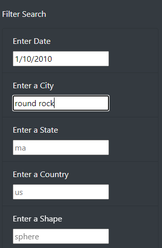
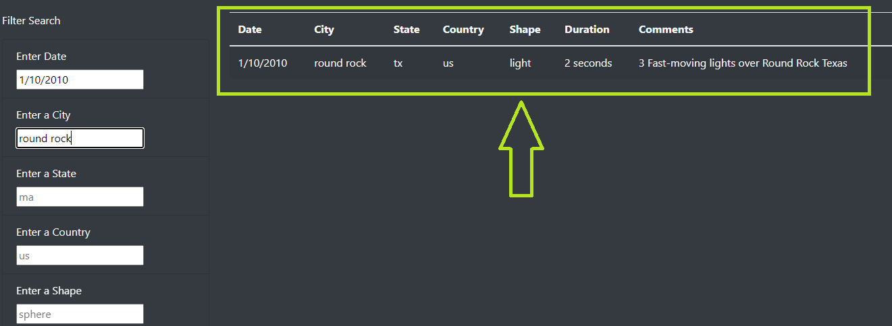

# UFOs
## Overview of Project
### Purpose
The purpose of this analysis was to filter data on UFO sightings based on multiple criteria inputed by the user.

### Background
In this project, a webpage with a dynamic table was created that allowed users to filter based on the date alone.  The code was improved with table filters to allow users to filter based on the city, state, country, and shape.

## Results
### How to Search Data on Webpage
To use the webpage, users can enter criteria they wish to filter for into the Filter Search boxes below the article to the left of the page and press enter (see picture below).

Example of filter criteria added...

### View Results
After adding criteria, results should populate in the table to the right.

## Summary
### Drawback to New Design
One drawback to the new design is that it does not include a filter box users can click to initiate filtering, making table usage not as intuitive.

### Recommendations for Further Development
My recommendations for further development are:
- Include a button users can click to initiate filtering rather than having them simply press enter.
- Collapse some of the filter fields so users don't think they are required to fill all fields before filtering.
